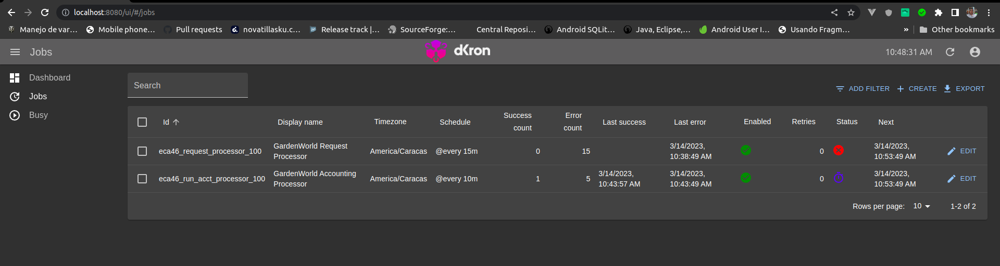
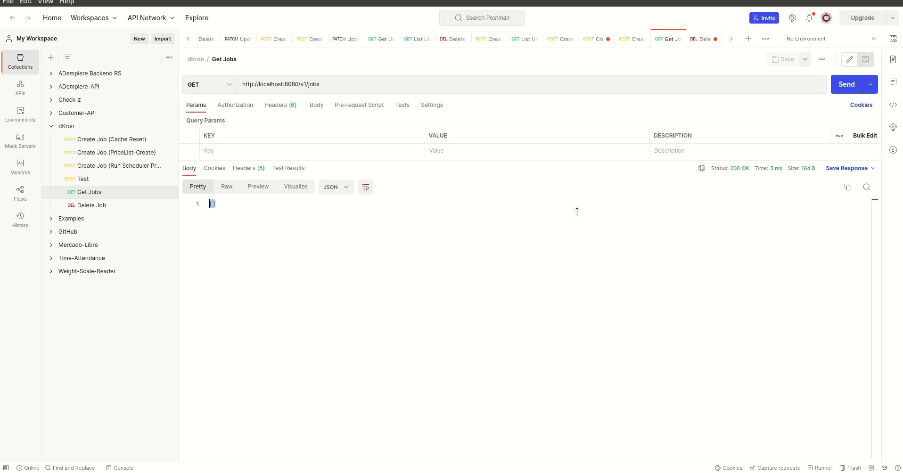
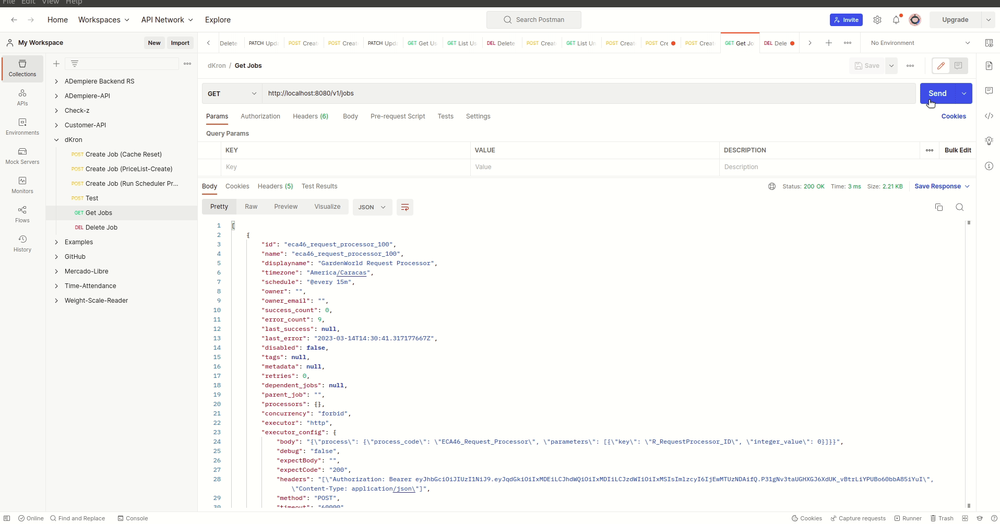

# ADempiere Business Processors

A project for convert all processors to process and allows run it as ADempiere Process.

The main scope for this project is allows run all processors with other scheduler instead ADempiere processor. Just now exists many schedulers that are created for run complex task and other executions.

I add a implementation for [dKron Processor](https://dkron.io/) because is very easy for install, very intuitive and simple, you are free of add more implementation for others task processors.



See the follow menu


Also see a movie:


## Requirements
- [JDK 11 or later](https://adoptium.net/)
- [Gradle 8.0.1 or later](https://gradle.org/install/)
- Optional [dKron Processor](https://dkron.io/)


## Binary Project

You can get all binaries from github [here](https://central.sonatype.com/artifact/io.github.adempiere/adempiere-business-processors/1.0.0).

All contruction is from github actions


## Some XML's:

All dictionary changes are writing from XML and all XML's hare `xml/migration`


## How to add this library?

Is very easy.

- Gradle

```Java
implementation 'io.github.adempiere:adempiere-business-processors:1.0.1'
```

- SBT

```
libraryDependencies += "io.github.adempiere" % "adempiere-business-processors" % "1.0.1"
```

- Apache Maven

```
<dependency>
    <groupId>io.github.adempiere</groupId>
    <artifactId>adempiere-business-processors</artifactId>
    <version>1.0.1</version>
</dependency>
```

## Example for it

Here a example exporting processors from ADempiere to [dKron Processor](https://dkron.io/)




Using [dKron Processor](https://dkron.io/) after export processors from ADempiere look:




## References

- For install dKron you can follow these [indications](https://dkron.io/docs/basics/installation)
- This project just add dictionary changes and ADempiere changes for export processors and use it as process instead, you can look [adempiere-middleware](https://github.com/adempiere/adempiere-middleware) for ADempiere gRPC service based
- The gPRC service can be converted to Rest API service using the [adempiere_backend_rs](https://github.com/adempiere/adempiere_backend_rs) project, a Rust project!